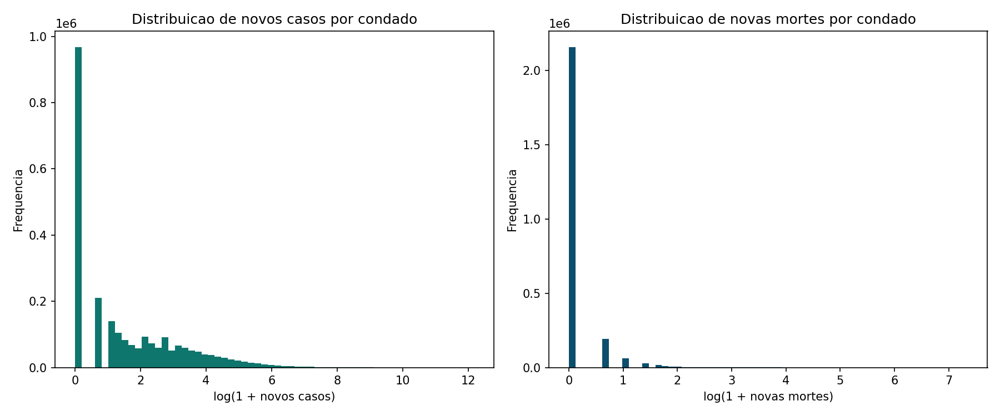
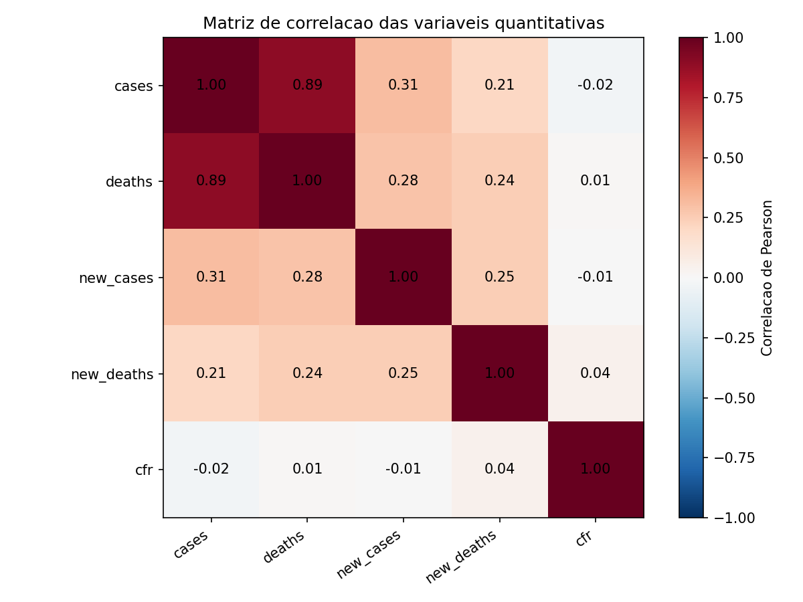
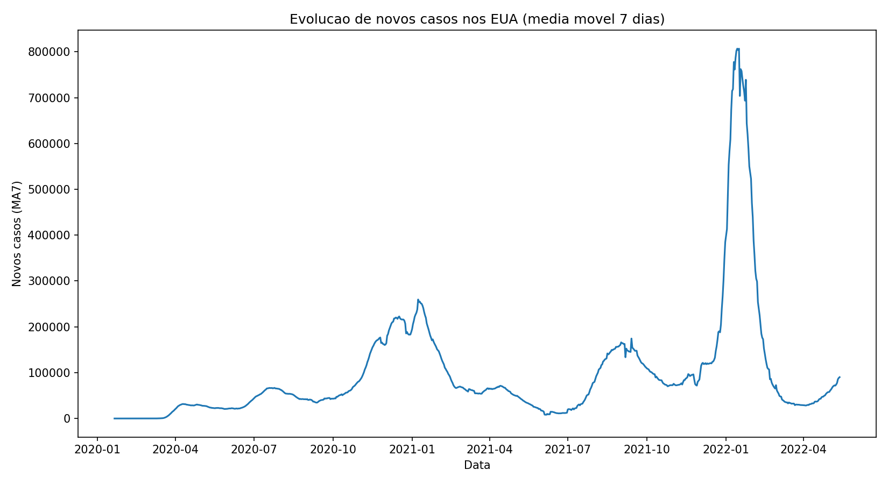

# Relatório Técnico

## 1. Identificação

**Projeto:** US Counties COVID-19 - Estatística e Probabilidade

**Integrantes:** `[PREENCHER COM OS NOMES COMPLETOS]`

**Repositório:** https://github.com/KayuryC/US-counties-COVID-19

## 2. Descrição do dataset

O dataset foi publicado pelo The New York Times em seu repositório aberto de dados de COVID-19:

- Fonte: https://github.com/nytimes/covid-19-data
- Arquivo: `us-counties.csv`
- Domínio: registros epidemiológicos de COVID-19 por condado dos Estados Unidos;
- Período analisado: 21/01/2020 a 13/05/2022;
- Instâncias: 2.502.832;
- Estados e territórios: 56;
- Condados/localizações: 3.277.

| Atributo | Tipo | Descrição |
| --- | --- | --- |
| `date` | data | Data do registro |
| `county` | categórico | Nome do condado ou localização |
| `state` | categórico | Estado ou território |
| `fips` | código | Identificador geográfico |
| `cases` | quantitativo | Casos acumulados |
| `deaths` | quantitativo | Mortes acumuladas |

A variável alvo `risk_level` foi derivada da média móvel de sete dias de novos casos por condado (`new_cases_ma7`):

- `low`: até o quantil 33%, com corte em 1,7143;
- `medium`: entre os quantis 33% e 66%, com corte superior em 10,1429;
- `high`: acima do quantil 66%.

## 3. Justificativa da escolha

O dataset é real, público e possui volume e complexidade suficientes para limpeza, análise quantitativa e qualitativa, estudo temporal e classificação. Ele contém valores ausentes, códigos geográficos incompletos, revisões em séries cumulativas e distribuições com forte assimetria, permitindo aplicar os conteúdos exigidos pela atividade.

O problema escolhido foi identificar padrões de propagação e classificar a intensidade epidemiológica associada aos atributos informados pelo usuário. A classificação representa o nível de risco do registro observado e não uma previsão futura de casos.

## 4. Tratamento e limpeza

### 4.1 Conversão de tipos

`date` foi convertida para data, `cases` e `deaths` para valores numéricos e `fips` para texto. FIPS é um código, portanto operações aritméticas sobre ele não possuem significado.

### 4.2 Valores ausentes

Foram encontrados:

- 23.678 valores ausentes em `fips`;
- 57.605 valores ausentes em `deaths`, todos associados a Porto Rico.

FIPS permaneceu ausente porque não existe imputação segura. As análises utilizam `state+county` como chave alternativa.

As mortes ausentes permaneceram como `NA` no dataset tratado. Preencher diretamente com zero produziria a interpretação incorreta de que não houve mortes. Na base de modelagem, um indicador `deaths_was_missing` é criado antes de zero ser usado apenas para permitir cálculos numéricos.

### 4.3 Inconsistências

Não foram encontradas duplicatas ou contagens negativas na fonte. Existiam 2.894 registros com `deaths > cases`. Nesses casos, `cases` foi elevado ao valor mínimo de `deaths`, preservando mortes observadas e garantindo a regra lógica de que cada morte pressupõe ao menos um caso.

### 4.4 Revisões cumulativas

Foram detectadas 40.527 quedas em séries cumulativas de casos e 11.144 em mortes. Essas quedas são interpretadas como correções retroativas da fonte. Ao calcular novos eventos, diferenças negativas são limitadas a zero para não representar incidência negativa.

Trecho central da engenharia de atributos:

```python
df["new_cases"] = df.groupby(["state", "county"])["cases"].diff()
df["new_cases"] = df["new_cases"].fillna(df["cases"]).clip(lower=0)
```

### 4.5 Valores extremos e transformação

Valores altos não foram removidos automaticamente porque podem representar ondas epidemiológicas, notificações acumuladas ou revisões. A análise usa `log1p` para visualizar a cauda longa, e a Regressão Logística aplica a mesma transformação antes da padronização.

Impacto esperado: manter eventos relevantes, reduzir a influência numérica da assimetria e documentar limitações sem fabricar informação.

## 5. Análise exploratória

### 5.1 Distribuições

As contagens diárias são fortemente assimétricas:

| Quantil | Novos casos | Novas mortes |
| --- | ---: | ---: |
| 50% | 2 | 0 |
| 90% | 52 | 1 |
| 99% | 492 | 7 |
| 99,9% | 2.914,17 | 33 |



### 5.2 Relações entre variáveis

A correlação entre casos e mortes acumulados por estado na data final foi 0,9770. Estados com maior carga de casos tendem a possuir mais mortes, mas essa associação não implica causalidade nem letalidade igual entre estados.

No nível condado-dia, a correlação entre novos casos e novas mortes foi 0,2490, indicando associação positiva mais fraca e influência de defasagens, cobertura e revisões.



### 5.3 Padrões espaciais e temporais

California, Texas, Florida e New York aparecem entre os maiores totais acumulados. O pico nacional de novos casos em média móvel ocorreu em 14/01/2022, com aproximadamente 806.969 casos. O pico de novas mortes ocorreu em 12/01/2021, com aproximadamente 3.351 mortes.

Os picos pertencem a ondas diferentes e não devem ser comparados como uma relação temporal direta.



## 6. Análise probabilística com Bayes

As variáveis preditoras são:

- `month`;
- `day_of_week`;
- `new_cases`;
- `new_deaths`;
- `cfr`.

As probabilidades a priori foram calculadas na população de treino anterior ao corte temporal, antes da subamostragem:

| Classe | Priori |
| --- | ---: |
| `low` | 35,31% |
| `medium` | 33,00% |
| `high` | 31,70% |

Para cada classe, a implementação manual estima média e variância de cada atributo e calcula a verossimilhança pela distribuição Gaussiana:

```text
P(x_j | C) = 1 / sqrt(2*pi*variancia) *
             exp(-(x_j - media)^2 / (2*variancia))
```

Assumindo independência condicional entre atributos, as verossimilhanças são combinadas no domínio logarítmico. A posteriori segue:

```text
P(C | X) proporcional a P(C) * P(X | C)
```

Exemplo para mês 6, dia da semana 1, 10 novos casos, 0 novas mortes e CFR 0,01:

- `low`: aproximadamente 0,00%;
- `medium`: aproximadamente 99,73%;
- `high`: aproximadamente 0,27%;
- classe prevista pelo Bayes: `medium`.

O cálculo foi implementado sem classificador bayesiano pronto de biblioteca, permitindo demonstrar priori, verossimilhança e posteriori.

## 7. Classificadores e avaliação

Além do Bayes, foram treinados:

1. Regressão Logística com `log1p`, `StandardScaler` e solver `lbfgs`;
2. Árvore de Decisão com profundidade máxima 12 e mínimo de 20 amostras por folha.

A validação foi temporal:

- treino: datas anteriores a 26/11/2021;
- teste: datas a partir de 26/11/2021;
- amostra de treino: 360.000 registros;
- amostra de teste: 90.000 registros.

| Método | Acurácia | Precisão | Recall | F1-score |
| --- | ---: | ---: | ---: | ---: |
| Bayes Manual | 0,5925 | 0,6897 | 0,5925 | 0,5874 |
| Regressão Logística | 0,6037 | 0,6551 | 0,6037 | 0,5963 |
| Árvore de Decisão | 0,6594 | 0,6713 | 0,6594 | 0,6586 |

A Árvore de Decisão apresentou o melhor desempenho geral. O Bayes possui menor acurácia, mas oferece interpretação probabilística explícita. As matrizes de confusão completas estão no dashboard e em `reports/model_comparison_report.md`.

## 8. Conclusões

O projeto mostrou que:

- os dados possuem forte concentração espacial e temporal;
- transformações logarítmicas são adequadas para as distribuições observadas;
- a distribuição das classes muda ao longo do tempo;
- a validação temporal produz uma estimativa mais realista que uma divisão aleatória;
- a Árvore de Decisão foi o melhor modelo entre os métodos avaliados;
- o Bayes manual atende ao objetivo conceitual de explicar as etapas probabilísticas.

## 9. Limitações

- A variável alvo é derivada de quantis globais e pode não generalizar para outros períodos.
- `new_cases` participa indiretamente da construção de `new_cases_ma7`; o sistema classifica intensidade atual, não faz previsão futura.
- Registros do mesmo condado possuem dependência temporal.
- Mortes por condado em Porto Rico não foram reportadas.
- As probabilidades da Regressão e da Árvore não foram calibradas.
- Não foram incluídas população, vacinação, idade ou capacidade hospitalar.

## 10. Reprodutibilidade

O pipeline completo, os comandos de execução, os testes e os endpoints estão documentados no `README.md`. Os modelos versionados e `backend/models/model_metrics.json` permitem reproduzir o dashboard sem retreinar durante a apresentação.
